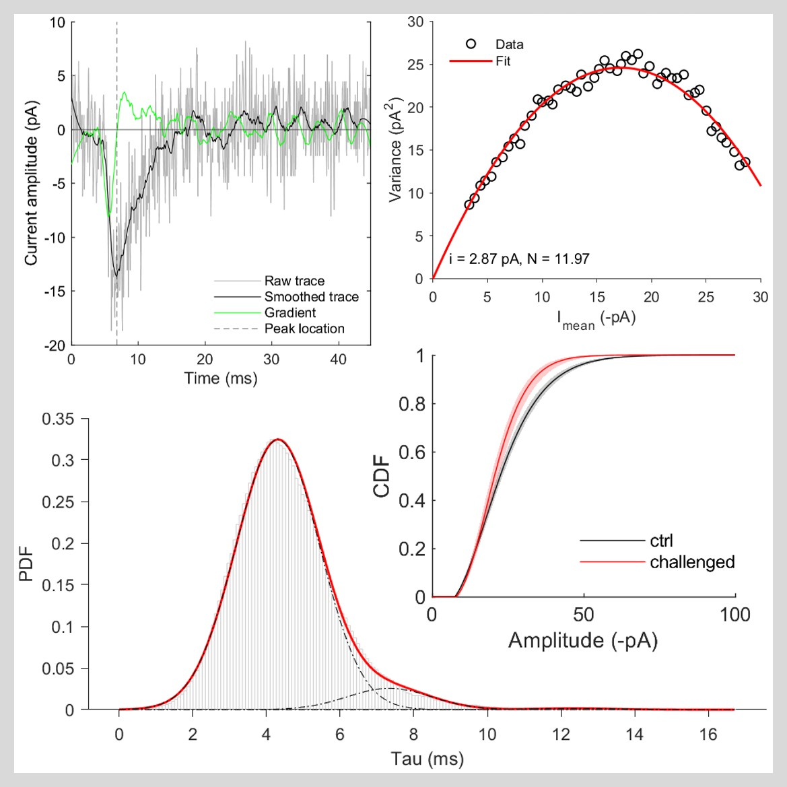

[](https://www.mathworks.com/matlabcentral/fileexchange/123630-ephys-analysis-toolbox)

# Ephys Analysis Toolbox

Man Ho Wong  
Xu Lab, Department of Neuroscience, University of Pittsburgh.  
January, 2023

## Table of contents

1. [Overview](#1-overview)
2. [Toolbox contents](#2-toolbox-contents)
3. [Installation](#3-installation)
4. [Usage](#4-usage)
5. [Algorithms](#5-algorithms)
6. [About](#6-about)

# 1. Overview

<p style="text-align:center;"></p>

Ephys Analysis Toolbox is an open-source MATLAB toolbox for batch processing of postsynaptic current (PSC) data. The Toolbox is organized into three modules, each comprising a collection of functions for different analyses:
- `kinetics` : for event decay analysis and non-stationary fluctuation analysis (NSFA).
- `membrane_props` : for passive membrane properties analysis.
- `mini_props` : for mEPSC frequency and amplitude analysis.

The Toolbox also comes with ready-to-use templates and demo data. See the [Usage](#4-usage) section for more info.

This toolbox is primarily designed to process miniature EPSC (mEPSC) data, though some functions can also be used to process other types of PSC data if the data format is compatible (for example, you can use it to analyze passive membrane properties of evoked EPSC recordings as long as you can provide the capacitance transient of each sweep).

# 2. Toolbox contents

```
(only top two levels are shown)
./
 |---demo_data/               # Sample recordings for demonstration
 |   |---transient_trace/     # Capacitance transient of every sweep
 |   |---event_props/         # Info of every detected event
 |   |---event_trace/         # Trace of every detected event
 |   |---fileIndex.xlsx       # Recording information
 |
 |---functions/               # Functions for building an analysis pipeline
 |   |---common/              # Common functions used by all modules
 |   |---kinetics/            # Module for event decay analysis and NSFA
 |   |---membrane_props/      # Module for passive membrane properties
 |   |---mini_props/          # Module for mEPSC frequency and amplitude
 |
 |---resources/               # Documentation, images, etc.
 |
 |---templates/               # Templates written with this toolbox
 |   |---cleanData.m          # Custom script to clean data
 |   |---pipeline.mlx         # Ready-to-use analysis pipeline
 |   |---runFitDecay.m        # Batch analysis of event decay
 |   |---runFitGroupDist.m    # Batch analysis of decay parameter distribution
 |   |---runMembraneProps.m   # Batch analysis of passive membrane properties
 |   |---runNSFA.m            # Batch Non-stationary Fluctuation Analysis
 |
 |---.gitignore
 |---LICENSE
 |---README.md                # YOU ARE HERE
```
# 3. Installation

## 3.1 Requirements
- MATLAB R2021b. Earlier versions supporting the data type `table` should also work (not tested).
- Required toolboxes  (in MATLAB, go to Home Tab > Add-Ons > Get Add-Ons):
    - Statistics and Machine Learning Toolbox
    - Curve fitting Toolbox (for decay fitting and distribution fitting)
    - Optimization Toolbox (for event CDF fitting)

## 3.2 Installation options

### A. Install the Toolbox via MATLAB Add-On Explorer
1. In MATLAB, go to Home Tab > Add-Ons > Get Add-Ons.
2. Search for 'Ephys Analysis Toolbox'
3. On the homepage of this Toolbox, click Add > Add to MATLAB.

### B. Install the Toolbox by installer
1. Download the installer `EphysAnalysisToolbox.mltbx` [here](/EphysAnalysisToolbox.mltbx) or via MATLAB File Exchange.
2. Run the installer.

### C. Use the Toolbox directly without installation
1. Download the entire Toolbox package from [GitHub](https://github.com/manhowong/ephys-analysis-toolbox).
2. Add all folders and subfolders of the package to the MATLAB search path whenever you start a new MATLAB session. You can use the following command:
   ```
   addpath( genpath('path/to/the/package') ) 
   ```

# 4. Usage

## 4.1 Prepare data

For batch processing, you will need **(A)** the raw data files, and **(B)** a file index that provides information for the identification of recordings.

> To get a sense of how the files should look like, check out the [demo data](/demo_data). This dataset was extracted from 10 sample recordings and is ready for analysis. 

### A. Raw data files

Each module requires a specific type of raw data as input:

| Module           | Data type                                                                    |
|------------------|------------------------------------------------------------------------------|
| `kinetics`       | Trace of detected event ([example](/demo_data/event_trace/1.txt))            |
| `membrane_props` | Trace of capacitance transient ([example](/demo_data/transient_trace/1.txt)) |
| `mini_props`     | Properties of detected event ([example](/demo_data/event_props/1.txt))       |

See [`prepare_data.md`](resources/prepare_data.md) for data specifications.

File naming and organization:
- Raw data files should be saved in `.txt` format.
- To associate a raw data file with the recording where its data was extracted from, the file should be named after the recording (e.g. name or ID of the recording file). Therefore, two files should have an identical name if both contain data extracted from the same recording.
- Organize raw data files by the kind of data they contain, for example:

    ```
    raw_data/                 
    |---transient_trace/       # Traces of capacitance transients
    |   |---recording1.txt
    |   |---recording2.txt
    |   |---recording3.txt
    |---event_props/           # Properties of every detected events
    |   |---recording1.txt
    |   |---recording2.txt
    |   |---recording3.txt
    |---event_trace/           # Traces of detected events
        |---recording1.txt
        |---recording2.txt
        |---recording3.txt
    ```

### B. File index
To identify the recordings, you need to provide an index containing info about the recordings and save it as a `.xlsx` file. It must contain at least the following three columns (with exact same names):
- `fileName` : FULL file name (must be UNIQUE) e.g. `recording1.txt`.
- `age` : Age of animal in days (must be numeric).
- `include` : Enter `0` to exclude a file from analysis, `1` to include. (For manual data cleaning; If you want to clean data programmatically, enter `1` for all files here and then apply your data cleaning script.)

Example of a file index:

| fileName       | mouseID | condition | sex | DOB      | age | include |
|----------------|---------|-----------|-----|----------|-----|---------|
| recording1.txt | 1001    | ctrl      | m   | 01/01/23 | 31  | 1       |
| recording2.txt | 1001    | ctrl      | m   | 01/01/23 | 31  | 1       |
| recording3.txt | 1010    | ctrl      | f   | 01/01/23 | 32  | 1       |

The easiest way to create a file index is probably using [`fileIndex.xlsx`](/demo_data/fileIndex.xlsx) in the `demo_data` folder as a template. 

## 4.2 Run analysis using script templates

In the [`templates`](/templates/) folder, you will find a collection of script templates written with the Toolbox. You can use these templates directly to analyze your data.

- `pipeline.mlx` : This is an analysis pipeline covering all modules of the Toolbox, except that batch processing is not available for some analyses (e.g. NSFA). For those analyses, you may use the templates for batch analysis (see below).
- `runFitDecay.m` : computes the decay parameters of each event in every recording found in a folder.
- `runFitGroupDist.m` :  analyzes the distribution of decay parameters by recording and by experimental group.
- `runMembraneProps.m` :  computes the passive membrane properties of every recording found in a folder.
- `runNSFA.m` :  runs NSFA on every recording found in a folder.
- `cleanData.m` : cleans up data for statistical analysis (e.g. outliers are removed).

Instructions for each template are included in the file itself.

## 4.3 Export the processed data/ analysis results

- Some functions require you to provide a folder (`outputDir`) for file export:
    - If the folder does not exist, the folder will be created at the provided location.
    - If the folder already exists, new output files will overwrite existing ones with identical names.
- Output subfolder names and file names are generated automatically.

    > **Renaming output folders and files**  
    > For the Toolbox to recognize the processed data:
    > - Do NOT rename variables inside a `.mat` file
    > - Do NOT rename the following subfolders or files unless you need to update the group names:
    >    - `cdfParamsAndXyValues_<group name>.mat`
    >    - `<group name>` subfolders inside `exp_cdf` folder
    >    - `<group name>` subfolders inside `gamma_cdf` folder

## 4.4 Optional: Build your own analysis pipeline

You can build your analysis pipeline by modifying any of the above templates. You can also create a new pipeline from scratch using the functions in this Toolbox.

Inside each module's folder (e.g. [`/functions/kinetics`](/functions/kinetics/)), you will find functions that can be used directly to analyze one recording file (e.g. `nsfa.m`) or one group of recordings (e.g. `fitGroupDist.m`). For batch processing, you just need to run these functions iteratively on multiple recordings or groups (This is basically what the above templates do: e.g. `runNSFA.m` runs `nsfa.m` iteratively).

> **Build from scratch**  
Alternatively, you can build your pipeline from scratch, using the functions in [`/functions/common/`](/functions/common/). The general steps are:
> 1. Import the raw data
> 2. Signal processing (e.g. detect peaks, compute frequency/IEI, etc.)
> 3. Transform data (e.g. merge datasets, bootstrap the data, etc.)
> 4. Signal analysis (e.g. decay fitting, NSFA, etc.)
> 5. Clean data (e.g. remove outliers, etc.)
> 6. Sort processed data (e.g. group data by conditions)
> 7. Statistical analysis
> 8. Export processed data/analysis results

# 5. Algorithms

- Algorithms for signal processing are explained [here](/resources/signal_processing_algorithms/).
- Algorithms for ephys. analysis are explained [here](/resources/analysis_algorithms/). 

# 6. About

## License

This Toolbox is licensed under the [GNU General Public License v3.0](https://github.com/manhowong/ephys-analysis-toolbox/blob/78d01eba0790664c0792e4cf3f39081448774af7/LICENSE).

## References

The core algorithm for non-stationary fluctuation analysis (NSFA) was inspired by:

**Hartveit, E., & Veruki, M. L. (2007).** Studying properties of neurotransmitter receptors by non-stationary noise analysis of spontaneous postsynaptic currents and agonist-evoked responses in outside-out patches. Nature protocols, 2(2), 434–448. https://doi.org/10.1038/nprot.2007.47
Fabius, J. (2022). violin (Version 1.0.0) [Computer software]. MATLAB Central File Exchange. Retrieved June 1, 2022. https://www.mathworks.com/matlabcentral/fileexchange/72424-violin

Code for CDF fitting was adapted from:

**Liu, M., Lewis, L. D., Shi, R., Brown, E. N., & Xu, W. (2014).** Differential requirement for NMDAR activity in SAP97β-mediated regulation of the number and strength of glutamatergic AMPAR-containing synapses. Journal of Neurophysiology, 111(3), 648–658. https://doi.org/10.1152/jn.00262.201


## Acknowledgment
We would like to thank the members of Schlueter Lab at the University of Pittsburgh, USA and the University of Goettingen, Germany for their valuable input on the algorithm of NSFA.


