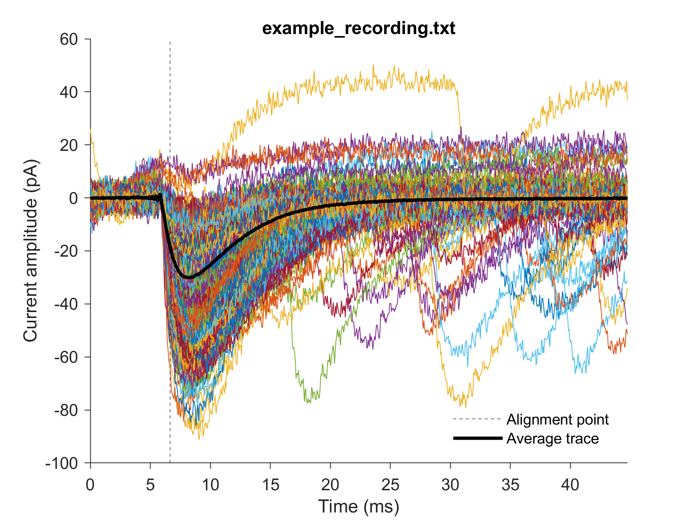
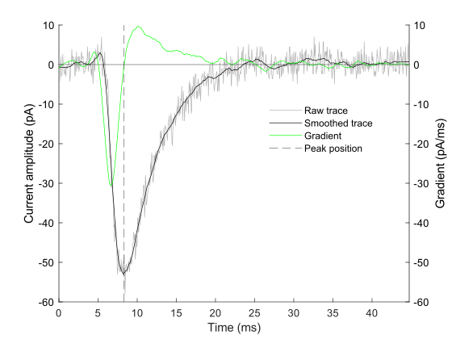
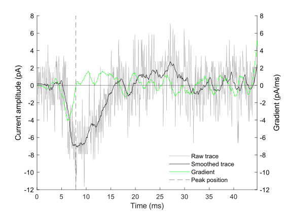
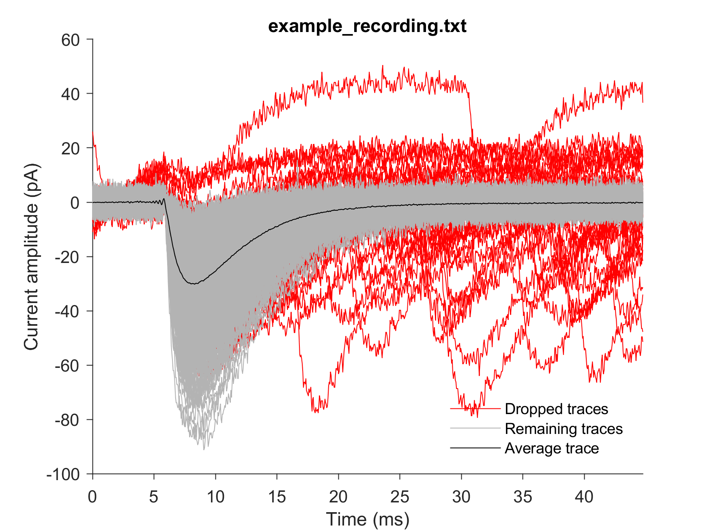
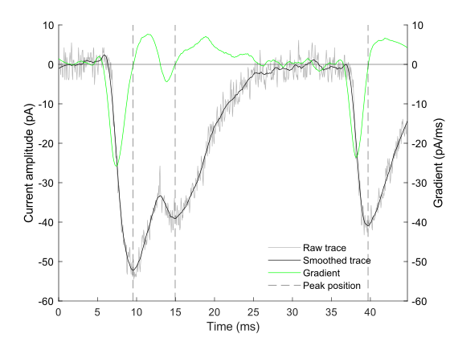
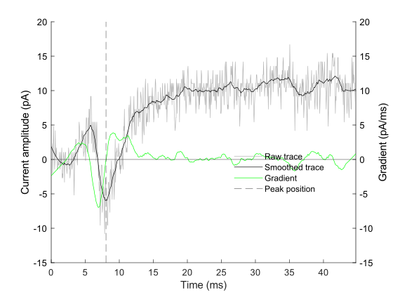
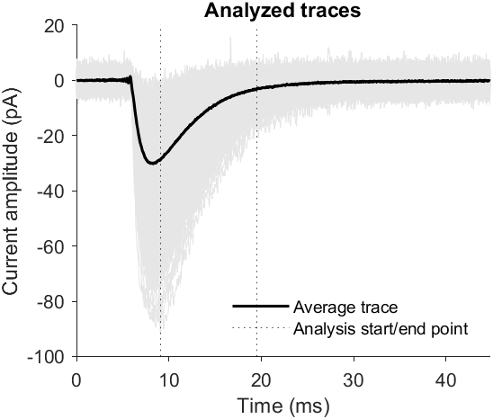
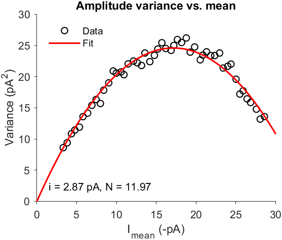

# Non-stationary fluctuation analysis (NSFA)

Man Ho Wong  
Department of Neuroscience  
University of Pittsburgh

This page documents the core algorithm of NSFA. The source code and the data used in the analysis will be available to the public once the work is accepted for publication, hopefully in 2023!

The following algorithm is an optimized implementation of the analysis procedures described in Hartveit and Veruki (2007). It can be used for automatic analysis of large datasets containing miniature EPSC (mEPSC) signals.

> Hartveit E, Veruki ML. Studying properties of neurotransmitter receptors by non-stationary noise analysis of spontaneous postsynaptic currents and agonist-evoked responses in outside-out patches. Nat Protoc. 2007;2(2):434-48. doi: 10.1038/nprot.2007.47. PMID: 17406605.

---

# Procedures

## 1. Align traces by the point of fastest rise

Traces can be aligned by the point of fastest rise with MiniAnalysis Program (Synaptosoft).
All traces have the same length of baseline (4 ms) and the same total length (44.75 ms). Most events decay back to baseline within this time window.

Example of aligned traces and the average trace in `example_recording.txt` ↓

## 2. Remove noisy/ unstable traces and traces with overlapping events

NSFA is sensitive to noise and signal stability as amplitude fluctuation is being analyzed To control data quality, traces are removed from the analysis if one of the following criteria is matched:
1. The amplitude of a trace's tail falls outside a user-defined range (relative to the average trace). This indicates unstable recording.
2. The baseline falls outside a user-defined range (relative to the trace tail). This indicates unstable recording.
3. The event in the trace does not pass the detection thresholds or the trace has more than one event (i.e. overlapping events).
4. The peak occurs 1 ms or later after the average peak.

Event peaks in each trace are detected automatically as follows:
The trace is first smoothed to reduce noise. (Instead of smoothing, noise can also be removed by filters but it is probably less efficient and unnecessary for the purpose of peak detection.) The first derivative (gradient) at each time point of the smoothed trace is then computed. At a zero-crossing where the sign of gradient switches (e.g. for downward peaks, sign switches from negative to positive), if the rise gradient and the decay gradient surround the zero-crossing pass the gradient thresholds, and the amplitude passes the amplitude threshold, the zero-crossing will be detected as an event peak.

Examples of traces passing the above criteria ↓

The algorithm first removes traces matching criteria 1 to 3 and then updates the average trace. Lastly, traces matching criterion 4 are removed and the average trace is updated.

Example showing traces removed from analysis and the remaining traces in `example_recording.txt` ↓

Some examples of the removed traces are shown below.

A trace with multiple peaks ↓

An unstable trace ↓

A trace without detectable events ↓

## 3. Zero each trace by its own baseline
Each trace is zeroed to the average amplitude within its baseline region.

## 4. Get an average trace from all traces
An average trace can be generated by averaging amplitude of all traces at each time point.

## 5. Locate the peak of average trace
Peaks are detected as in step 2.

## 6. Locate decay region of average trace (e.g. decay from 95% to 10% of peak amplitude of average trace)

Only the 95% to 10% decay region is used for the analysis. To locate this window, the theoretical amplitude at 95% of peak and at 10% of peak are first calculated from the peak amplitude of the average trace as the decay start point and decay end point. The exact amplitude likely does not exist in the trace, but the points nearest to the theoretical decay start point and end point can be used. To minimize the effect of noise on decay region location, three time points are used as the search window for the decay start point and end point.

Locations of decay start point and end point for the analysis of `example_recording.txt` ↓

## 7. Compute mean of amplitude (μ) at each time point within the decay region

## 8. Compute amplitude variance (σ^2) at each time point within the decay region using peak-scaled average trace

To get the peak-scaled average trace, scale average trace so that its peak amplitude equals to the amplitude of the trace being compared to at the same time point.

## 9. Fit data to model to find i and N

Using the mean and variance computed in previous steps, the variance-mean relationship of can be fitted with the following function based on a binomial model for quantal neurotransmitter release:

$σ^2 = i\cdotμ - \dfrac{μ^2}{N} + σ_{background}^2$ 

Single-channel current (i) and number of channels (N) can be obtained from the fitting results.
 
Fitting results of `example_recording.txt` ↓

