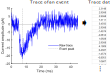
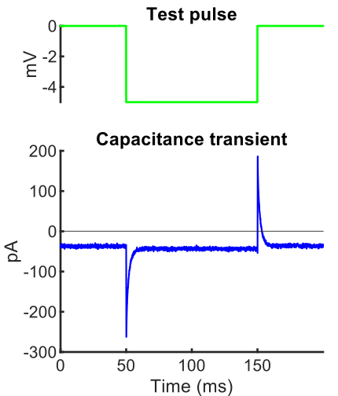

# Prepare data for analysis

Man Ho Wong  
Xu Lab, Department of Neuroscience, University of Pittsburgh.  

Each module of this Toolbox requires a specific type of raw data as input:

| Module           | Data type                                                           |
|------------------|---------------------------------------------------------------------|
| `kinetics`       | [Trace of detected event](#1-trace-of-detected-event)               |
| `membrane_props` | [Trace of capacitance transient](#2-trace-of-capacitance-transient) |
| `mini_props`     | [Properties of detected event](#3-properties-of-detected-event)     |

# 1. Trace of detected event

## 1.1 File format

Each event trace is an array of sampling points (amplitude values in **pA**) of an event.

An event trace file is a `.txt` file containing columns of event traces from a recording.
Below is an event trace file in `demo_data` ([example](../demo_data/event_trace/1.txt)). The first ten sampling points of the first three traces are shown here.

| Event 1  | Event 2  | Event 3  | ... |
|----------|----------|----------|-----|
| 0.030098 | 3.59169  | -6.40083 |     |
| -2.46803 | 1.725616 | -8.27694 |     |
| -4.34414 | 2.347641 | -7.65492 |     |
| -6.22025 | -0.15049 | -9.53102 |     |
| -1.84601 | -0.78255 | -10.1531 |     |
| -0.59193 | -2.64862 | -7.02286 |     |
| -0.59193 | -1.40457 | -10.1531 |     |
| -1.84601 | 0.471535 | -2.64862 |     |
| -2.46803 | 2.969666 | 2.347641 |     |
| -1.84601 | 2.969666 | -0.77251 |     |
| ...      | ...      | ...      |     |

Note that column names are not required and they are shown here for illustration only. Indeed, headers and column names will be ignored.

> **Using Mini Analysis Program (Synaptosoft)**  
In case you are using the Mini Analysis Program (Synaptosoft) to extract traces from recordings, the extra info in the exported file (e.g. headers, time column and average trace column) will be ignored. For example, [10.txt](../demo_data/event_trace/10.txt), which was exported from the Mini Analysis Program, will be read correctly as other event trace files.

## 1.2 Trace specs
- **Alignment**: All events in a recording must be aligned by their points of fastest rise (see figure below).
- **Baseline**: Each trace must contain a baseline. (Exact length depends on the position of alignment, but it should meet a minimum length in all traces.)
- **Total length**: It is recommended that the trace is long enough that the decay reaches the user-defined decay end point (e.g. 10% of the peak).
- **For batch processing**, traces in ALL FILES must have an equal total length.

    Events aligned by their points of fastest rise. Individual traces are colored differently.
    
    

> **Overlapping events**   
As you might have noticed in the above figure, some traces have more than one event (overlapping events in one single trace). This happens when the trace length is too long such that the trace covers the next event(s), or the frequency of events is very high. These traces will be excluded from analysis automatically and you will end up with fewer traces for analysis (See [signal_inspection.md](signal_processing_algorithms/signal_inspection.md)). To reduce the number of overlapping events, adjust your trace length.

# 2. Trace of capacitance transient

## 2.1 File format

Each capacitance transient trace is an array of sampling points (amplitude values in **pA**) from a *sweep*.

A transient trace file is a `.txt` file containing columns of transient traces from a recording.
Below is a transient trace file in `demo_data` ([example](../demo_data/transient_trace/1.txt)). The first ten sampling points of the first three transients are shown here.

| Sweep 1 | Sweep 2 | Sweep 3 | ... |
|---------|---------|---------|-----|
| 0       | 0       | -4.375  |     |
| 3.125   | 1.25    | -3.75   |     |
| 2.5     | 2.5     | 0       |     |
| 2.5     | -1.875  | 4.375   |     |
| -3.75   | -1.875  | -0.625  |     |
| -6.875  | -0.625  | 0       |     |
| -0.625  | 1.875   | -2.5    |     |
| -2.5    | 0.625   | -0.625  |     |
| -6.25   | -0.625  | 5.625   |     |
| -1.25   | 0       | 1.875   |     |
| ...     | ...     | ...     |     |

Note that column names are not required and they are shown here for illustration only. Indeed, headers and column names will be ignored.

## 2.2 Trace specs

- **Starting point**: All traces must start at the same time point relative to the test pulse. (For example, in the figure below, the trace starts at 50 ms before the test pulse.)
- **Baseline**: Each trace must contain a baseline (i.e. before the test pulse was applied). 
- **Total length**: All traces must have equal length. It must be long enough to cover at least the charging phase (til stable current).
- **For batch processing**, traces in ALL FILES must have an equal starting point, baseline, and total length.

Below is an example of a capacitance transient trace. This transient was evoked by a negative step test pulse that lasted from 50 ms to 150 ms. The trace starts at 50 ms before the test pulse (i.e. at 0 ms).

 

## 2.3 Igor Tool to extract transient

If your recordings are acquired with Igor Pro, you may use [this tool](https://github.com/manhowong/igor-pro-tools/tree/main/getTransients) to extract capacitance transients from the recordings in batch.

 # 3. Properties of detected event

## 3.1 File format

- An event properties file is a `.txt` file where each row represents a recording and each column is an event property (e.g. amplitude).
- The file must contain at least these two columns (with EXACT same names):
    - `Time (ms)` : time stamp of the event
    - `Amplitude` : peak amplitude of the event

- Column names are MANDATORY.
- All data must be numeric.
- You can have as many columns (i.e. event properties) as you want, as long as the above requirements are satisfied.

Below is an event properties file in `demo_data` ([example](../demo_data/event_props/1.txt)). This recording has 500 events and the first five events are shown here.

| 500 | Time (ms) | Amplitude | Rise (ms) | Decay (ms) | Area  | ... |
|-----|-----------|-----------|-----------|------------|-------|-----|
| 1   | 25.2      | 11.788    | 1.45      | 3.35       | 31.47 |     |
| 2   | 282.35    | 30.59     | 1.6       | 3.9        | 114.4 |     |
| 3   | 388.15    | 31.603    | 1         | 4.55       | 98.48 |     |
| 4   | 437.9     | 13.032    | 2.65      | 3.35       | 49.34 |     |
| 5   | 507.35    | 14.397    | 1.15      | 0.7        | 14.18 |     |
| ... |           |           |           |            |       |     |

> **Using Mini Analysis Program (Synaptosoft)**  
Data of detected events exported from the Mini Analysis Program (Synaptosoft) satisfies the above requirements.

> The reason why `Time (ms)` and `Amplitude` must be used as the column names for time stamp and amplitude columns is that the Toolbox was originally developed to process data extracted by the Mini Analysis Program, which uses these two column names. The Toolbox will not function if it cannot find these two columns.